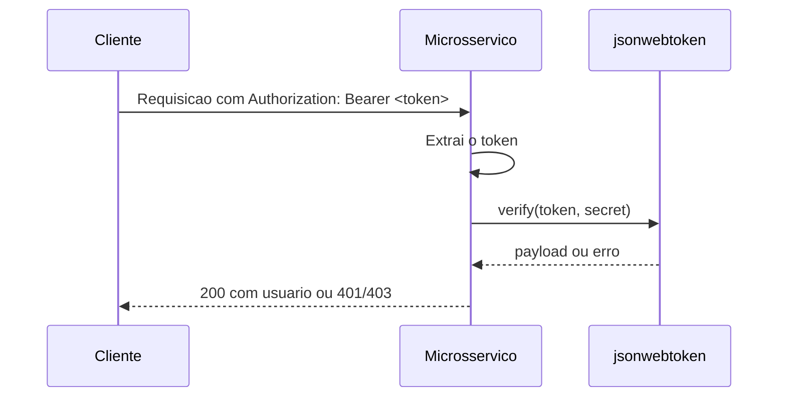

# Roteiro didatico: autenticacao, testes, debug e Kubernetes

Este roteiro foi escrito para acompanhar o codigo real deste repositorio e focar em quatro pontos: testes com Jest e Supertest, depuracao no VS Code Codespaces, manifesto Kubernetes e a razao tecnica da duplicacao do middleware de autenticacao.

## 1) Estrutura de testes com Jest e Supertest

O desenho dos testes segue dois niveis bem objetivos:

- Testes unitarios isolam a funcao [middlewareAuth.js](microsservices/auth/middlewareAuth.js), substituindo `jsonwebtoken.verify` por um mock.
- Testes de integracao exercitam as rotas HTTP com Supertest, usando `request(app)` e evitando abrir porta real.

Uma estrutura didatica para o repositorio fica assim:

```text
microsservices/
  auth/
    __tests__/
      middlewareAuth.test.js
      server.test.js
  carrinho/
    __tests__/
      server.test.js
  catalogo/
    __tests__/
      server.test.js
  pedidos/
    __tests__/
      server.test.js
```

### O que cada tipo de teste valida

- Em [microsservices/auth/__tests__/middlewareAuth.test.js](microsservices/auth/__tests__/middlewareAuth.test.js), o foco e validar a leitura do header `Authorization`, os retornos `401` e `403` e o caso de sucesso que anexa `req.user`.
- Em [microsservices/auth/__tests__/server.test.js](microsservices/auth/__tests__/server.test.js), o foco e validar o fluxo HTTP completo: cadastro, login e emissao de JWT, sempre com dependencias externas mockadas.
- Nos demais servicos, a mesma ideia se repete: Supertest para a rota e mocks para `sqlite3`, `mongoose` e `mysql2/promise`.

### Padrão de mock recomendado

```javascript
const mockVerify = jest.fn();

jest.mock('jsonwebtoken', () => ({
  verify: (...args) => mockVerify(...args)
}));
```

Esse formato e importante porque permite simular sucesso e falha sem depender de um JWT real. Para rotas com tokens assinados, o mesmo principio vale para `jwt.sign`.

### Padrão de integração recomendado

```javascript
const request = require('supertest');
const app = require('../server');

test('GET /health retorna 200', async () => {
  const resposta = await request(app).get('/health');

  expect(resposta.status).toBe(200);
});
```

No fluxo de autenticacao, isso garante que a rota, o middleware e a resposta final continuam coerentes como um conjunto.

## 2) Debug passo a passo no VS Code Codespaces

O objetivo do debug aqui e enxergar a requisicao atravessando a cadeia completa: entrada HTTP, leitura do header, validacao do JWT e resposta da rota.

### Passo a passo

1. Abra o projeto no GitHub Codespaces e confirme que os servicos estao disponiveis na porta esperada. No compose atual, o auth roda em `3003`, catalogo em `3001`, carrinho em `3002` e pedidos em `3004`.
2. Abra o arquivo [microsservices/auth/middlewareAuth.js](microsservices/auth/middlewareAuth.js) e coloque um breakpoint dentro de `authenticateToken`, logo antes e logo depois de `jwt.verify`.
3. Se estiver depurando o auth, abra [microsservices/auth/server.js](microsservices/auth/server.js) e coloque breakpoints em `/register`, `/login` e `/oauth/social`.
4. No painel Run and Debug, crie ou use uma configuracao de Node.js apontando para o arquivo do servico com `--inspect=0.0.0.0:9229` e `cwd` dentro da pasta do microsservico.
5. Inicie a sessao de debug e envie uma requisicao com `curl` ou com a extensao REST Client. Exemplo para o auth:

```bash
curl -i http://localhost:3003/health
```

6. Ao parar no breakpoint, observe `req.headers.authorization`, o token extraido, o payload decodificado e o retorno em `res.status(...)`.
7. Se a intencao for depurar testes, use o debug do Jest para executar somente um arquivo, por exemplo `auth/__tests__/middlewareAuth.test.js`, e pare no mock ou no handler.

### O que observar no debugger

- `authHeader`: confirma se o header chegou ao servico.
- `token`: mostra se o prefixo `Bearer` foi removido corretamente.
- `err`: distingue token ausente, expirado ou invalido.
- `req.user`: confirma a injecao do usuario autenticado antes do `next()`.

### Exemplo de launch configuration para debug local no Codespaces

Se voce quiser criar uma configuracao de debug, esta e a forma minima e reutilizavel:

```json
{
  "version": "0.2.0",
  "configurations": [
    {
      "name": "Debug Auth Service",
      "type": "node",
      "request": "launch",
      "program": "${workspaceFolder}/microsservices/auth/server.js",
      "runtimeArgs": ["--inspect=0.0.0.0:9229"],
      "cwd": "${workspaceFolder}/microsservices/auth",
      "env": {
        "NODE_ENV": "development",
        "PORT": "3003"
      },
      "console": "integratedTerminal",
      "skipFiles": ["<node_internals>/**"]
    }
  ]
}
```

## 3) Kubernetes: o que o manifesto faz

O arquivo [microsservices/k8s-manifests.yaml](microsservices/k8s-manifests.yaml) foi organizado para cobrir os quatro servicos com recursos claros e previsiveis:

- `Secret` centraliza `JWT_SECRET` e as credenciais dos bancos externos.
- `PersistentVolumeClaim` garante persistencia do SQLite do carrinho.
- `Deployment` sobe cada microsservico com replicas, env vars e probes.
- `Service` expoe auth como `NodePort` e os demais como `ClusterIP`.

### Racional por tipo de Service

- `auth-service` usa `NodePort` porque geralmente e o ponto de entrada externo para testes manuais e integracoes.
- `catalogo-service`, `carrinho-service` e `pedidos-service` usam `ClusterIP` porque permanecem internos ao cluster e podem ser consumidos por outro servico ou por um ingress futuramente.

### Observacao importante sobre bancos

Os servicos de catalogo e pedidos dependem de MongoDB e MySQL, respectivamente. Neste arquivo, os endpoints foram parametrizados por variaveis de ambiente para manter o manifesto focado nos quatro microsservicos de aplicacao. Em um cluster real, esses bancos podem vir de StatefulSets, services gerenciados ou manifests adicionais.

## 4) Por que o middleware de autenticacao e duplicado

A duplicacao de [middlewareAuth.js](microsservices/auth/middlewareAuth.js), [middlewareAuth.js](microsservices/carrinho/middlewareAuth.js) e [middlewareAuth.js](microsservices/catalogo/middlewareAuth.js) faz sentido nesta arquitetura porque cada microsservico e implantado e evolui de forma independente.

### Razao tecnica

1. Cada servico valida o JWT localmente, sem dependencia de uma chamada de rede para um gateway central.
2. A validacao descentralizada reduz latencia e evita um ponto unico de falha.
3. O ciclo de deploy fica mais simples: atualizar uma regra de autenticacao nao exige recompilar ou redistribuir um pacote compartilhado em todos os servicos ao mesmo tempo.
4. O contrato do token permanece identico, mas a responsabilidade de checagem fica perto da borda de cada aplicacao.

### Trade-off assumido

Duplicar codigo aumenta o risco de drift entre arquivos. Por isso, a regra precisa ser pequena, previsivel e coberta por testes unitarios. Quando a logica crescer demais, o proximo passo natural e extrair um pacote interno compartilhado, ou centralizar a autenticacao em um gateway ou API gateway.



## Fechamento

Se voce seguir essa estrutura, tera tres beneficios imediatos: testes previsiveis, debug reproduzivel no Codespaces e um manifesto Kubernetes que reflete a topologia real do projeto.